# Reflektion

## Kapitel 2 Meaningful Names

Det finns mycket att ta i anspråk när det kommer till namngivning, men det som har påverkat min kod mest är argumenterbart det mest grundläggande: Intention-revealing names. Istället för att ha ett kort namn som är en halvsanning väljer jag istället ett längre namn som ger en klarare bild av vad det representerar. Exempelvis:
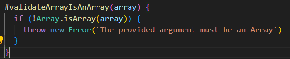

Tidigare är detta något jag hade namngett validateArray, som bara beskriver att den validerar men inte hur.

## Kapitel 3 Functions

Do one thing har påverkat min kodbas mest, att hitta lösningar på att bryta ut kod utan att påverka funktionalitet. En av utmaningarna med att bryta ut kod, samt att följa DRY-principen har varit namngivning. Genom att bryta ut kod till en privat metod som kan användas i andra metoder gör den mer generell, vilket reflekteras i namngivningen. När den privata metoden sedan används i andra metoder ska namnet vara beskrivande i vad den gör men också fungera i kontext till metoden den används i.

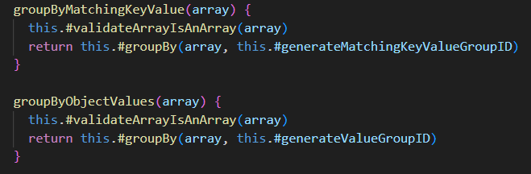

## Kapitel 4 Comments

Jag har försökt efterleva “comments are, at best, a necessary evil”. I och med det mantrat blir namngivning och kommentarer nära relaterat, bättre namngivning genererar mindre kommentarer. Jag har därför försökt namnge variabler, metoder och klasser på ett sätt som gör att kommentarer inte är nödvändiga. Just nu är de enda kommentarerna JSDoc-kommentarer för publika metoder i Labb 2. Detta för att när en användare använder mitt bibliotek inte ska behöva besöka min källkod för att exempelvis se vilka argument en metod tar emot, det ska direkt gå att se genom en IDE (Javadocs in Public APIs - “There is nothing quite so helpful and satisfying as a well-described public API”). Min app är uppbyggd av komponenter med beskrivande namn som gör de allra flesta kommentarer redundanta.

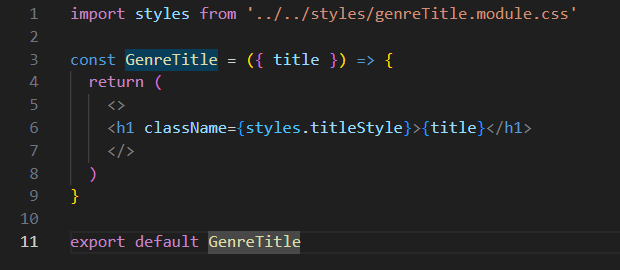

## Kapitel 5 Formatting

Det svåraste med formatering var att avgöra vilka konceptuella regler var viktigast. Exempelvis så har de publika metoderna i ArrayOrganizer.js “Conceptual Affinity”, inte bara liknande namngivning utan också i det faktum att alla är publika metoder. Det skapar dock längre distans till “Dependent Functions”. Jag valde att samla publika metoder först för att sedan samla de privata metoderna och ha metoder som beror på varandra så nära som möjligt (Dependent Functions).

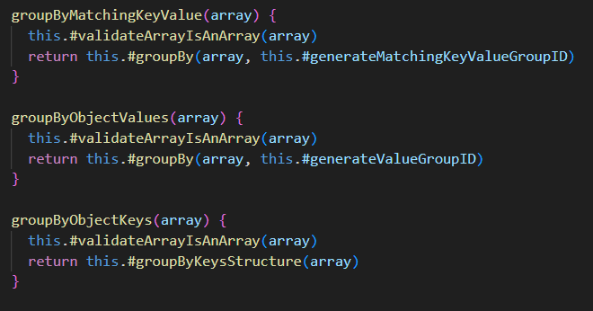
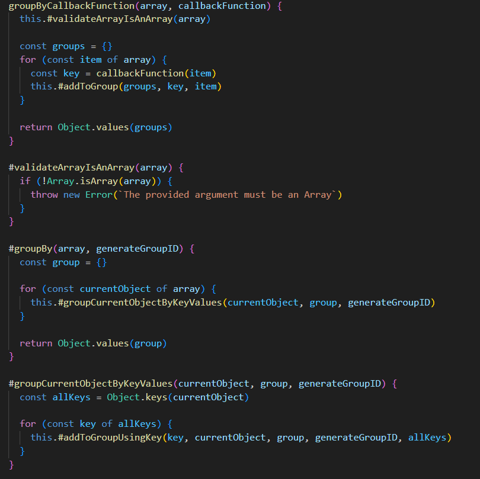
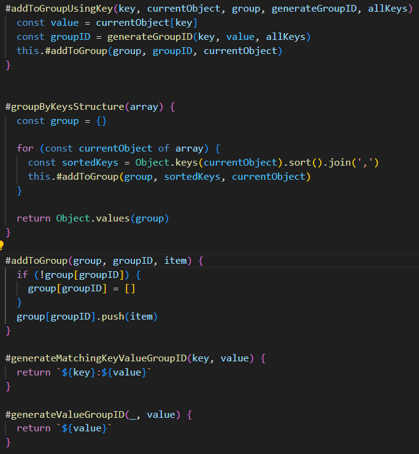

## Kapitel 6 Objects and Data-Structures

The Law of Demeter genomsyrar både min app och min modul,  “talk to friends, not to strangers”. Användning av ett ramverk som NextJs (som använder React-komponenter) främjar automatiskt detta då varje sida eller komponent bara importerar de komponenter eller beroenden som används där komponenten eller beroendet kapslar in sin funktionalitet (varje komponent kan ses som ett objekt).

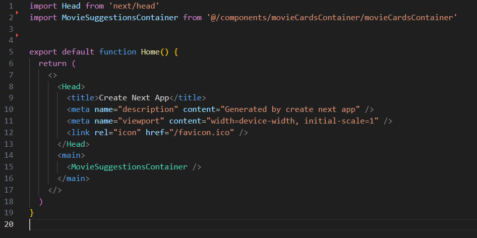

## Kapitel 7 Error Handling

Mycket i detta kapitel verkar vara antingen äldre sätt att hantera fel eller vara mer specifikt för Java. Exempelvis är throw redan implementerat i ramverket NextJs, försöker användaren att besöka en sida som inte existerar, kastar den ett undantag “404 Page is not found”. “Avoid checked exceptions” finns inte i JavaScript. Däremot tanke ställningen i Clean Code genomsyrar min felhantering, att “provide meaningful error messages”. 

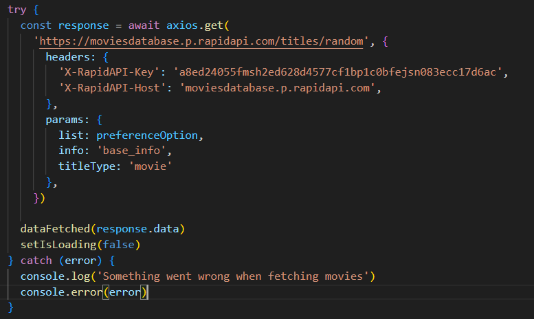

## Kapitel 8 Boundaries

I min app tog jag inte hänsyn till “Clean Boundaries". Min app beror mycket på APIet “Movies Database”. I den bästa av världar hade jag byggt upp en egen databas med filmer och skapat ett eget API att anropa för att hämta informationen. Men tiden det hade tagit att bygga upp denna databasen själv, utforma ett API till det och sedan implementera i min app fanns inte till denna uppgiften. 

## Kapitel 9 Unit tests

Min testning följde inte reglerna i TDD religiöst, däremot har jag test för varje publik metod och kontinuerligt kört testerna vid utbrytandet av kod vilket följer andan av TDD. Jag la mycket vikt vid “Keep Tests Clean” och “One Assert Per Test” där jag såg till att det är lätt att se vilken metod som testas och en beskrivande text för vad som testas.

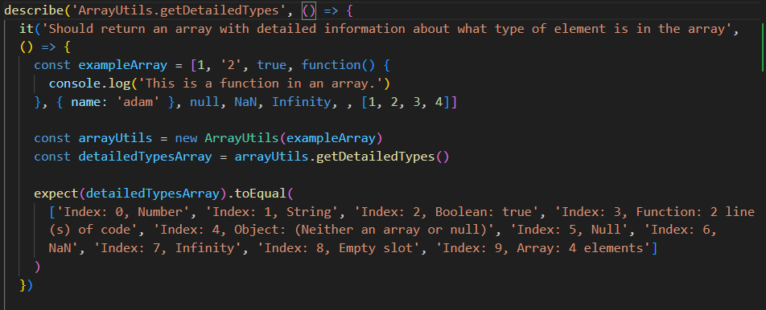

## Kapitel 10 Classes

Single responsibility principle har varit inspirationen från detta kapitlet. Varje klass har ett eget syfte, exempelvis gruppera objekt eller hitta objekt utifrån ett tillhandahållet värde. Man kan också se mina komponenter som en egen klass där varje komponent har ett eget syfte, exempelvis genreTitle.js vars uppgift är att rendera en genre rubrik.

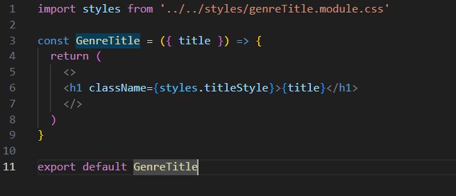

## Kapitel 11 Systems

Även om varken array-helper-library eller min app är några större system så är utformningen av arkitekturen och organisationen starkt kopplat till kapitel 11. Kapitel genomsyras av “modularity and separation of concerns”. Vilket som tidigare nämnt återfinns både i array-helper-library och min webbapp, hur varje klass eller komponent ansvarar för ett eget litet område. I array-helper-library återfinns 4 klasser, en för att delge information, en för att organisera, en för att hitta och en för att samla publika klasser.

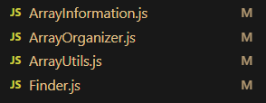
