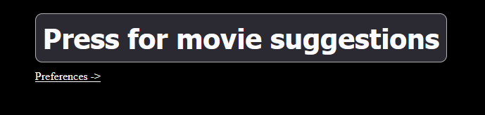
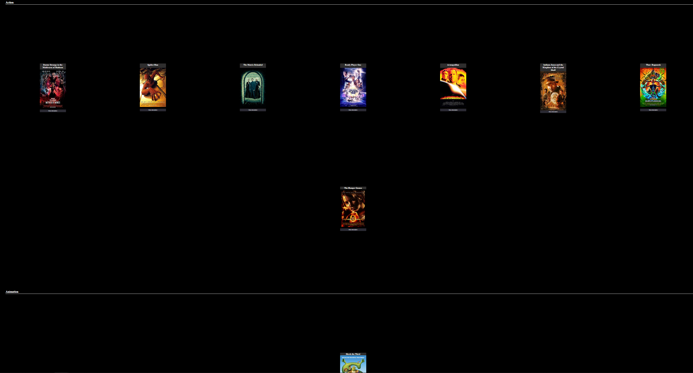
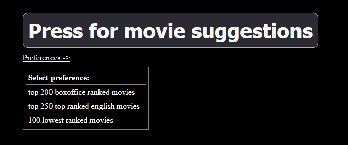
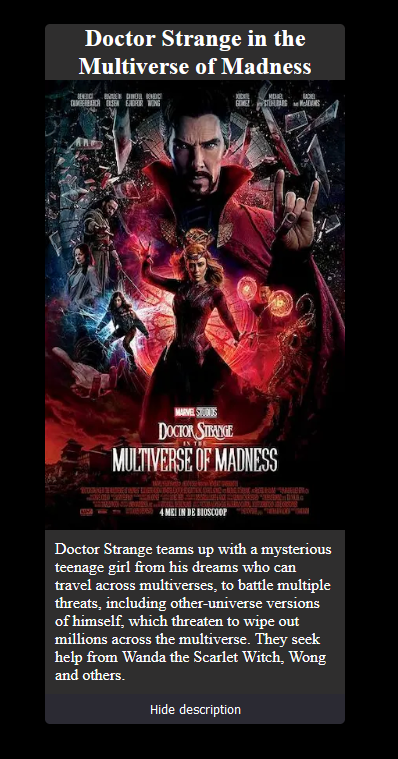

# Test Specification

## What will be tested and how

All requirements in [requirements](requirementSpecification.md). The tests will be tested manually, instructions can be found below under [instructions](#instructions).

## Test cases

| Test case      | Description| Use case|
| --------- |---------|---------|
|1.1| Button for getting movie suggestions shows movies | Movie button|
|1.2| After pressing button there is 10 suggestions | Movie button|
|1.3| The movies is divided by genre| Movie button|
|  2.1     | There is a list of preferences | Preference list| 
|  2.2     | After choosing "top 200 boxoffice ranked movies" it displays movies | Preference list|
|  2.3  | After choosing "top 250 top ranked english movies" it displays movies  | Preference list |
|2.4| After choosing "100 lowest ranked movies" it displays movies | Preference list|
|3.1| Every movie displays information | Movie information|
|3.2| Every movie has a picture | Movie information|
|3.3| Every movie has a title | Movie information |
|3.4| Every movie has a plot description that can be hidden/shown| Movie information |

## Manual testing

| Test      | UC1 |
| --------- |:----:|
| TC1.1     | OK | 
| TC1.2     | OK |
|TC1.3| OK|
| COVERAGE & SUCCESS   | OK    |




| Test      | UC2 |
| --------- |:----:|
| TC2.1     | OK | 
| TC2.2     | OK | 
|TC2.3| OK|
|TC2.4|OK|
| COVERAGE & SUCCESS   | OK    |



| Test      | UC2 |
| --------- |:----:|
| TC3.1     | OK | 
| TC3.2     | OK | 
|TC3.3| OK|
|TC3.4|OK|
| COVERAGE & SUCCESS   | OK    |




## Instructions

These instructions assume you have forked and cloned the project as well as ran

```
npm install 
```

### TC1.1 Button for getting movie suggestions shows movies

#### Test steps

* Run: 

```
npm run dev 
```
* Open localhost in a browser

* Click on the button "Press for movie suggestions"

#### Excpected result

* Movie suggestions are shown

### TC1.2 After pressing button there is 10 suggestions

#### Test steps

* Run: 

```
npm run dev 
```
* Open localhost in a browser

* Click on the button "Press for movie suggestions"

#### Excpected result

* 10 movie suggestions are shown

### TC1.3 The movies is divided by genre

#### Test steps

* Run: 

```
npm run dev 
```
* Open localhost in a browser

* Click on the button "Press for movie suggestions"

#### Excpected result

* 10 movie suggestions are shown divided by genre.

### TC2.1 There is a list of preferences

#### Test steps

* Run: 

```
npm run dev 
```
* Open localhost in a browser

* Click on "Preferences ->"

#### Excpected result

* A list of choices of preferences is shown

### TC2.2 After choosing "top 200 boxoffice ranked movies" it displays movies

#### Test steps

* Run: 

```
npm run dev 
```
* Open localhost in a browser

* Click on "Preferences ->"

* Click on "Top 200 boxoffice ranked movies"

* Click on the button "Press for movie suggestions"

#### Excpected result

* 10 movie suggestions are shown based on the preference

### TC2.3 After choosing "top 250 top ranked english movies" it displays movies

#### Test steps

* Run: 

```
npm run dev 
```
* Open localhost in a browser

* Click on "Preferences ->"

* Click on "Top 250 ranked english movies"

* Click on the button "Press for movie suggestions"

#### Excpected result

* 10 movie suggestions are shown based on the preference

### TC2.4 After choosing "100 lowest ranked movies" it displays movies

#### Test steps

* Run: 

```
npm run dev 
```
* Open localhost in a browser

* Click on "Preferences ->"

* Click on "100 lowest ranked movies"

* Click on the button "Press for movie suggestions"

#### Excpected result

* 10 movie suggestions are shown based on the preference

### TC3.1 Every movie displays information

#### Test steps

* Run: 

```
npm run dev 
```
* Open localhost in a browser

* Click on the button "Press for movie suggestions"

#### Excpected result

* 10 movie suggestions are shown divided by genre. Each movie should have information about it.

### TC3.2 Every movie has a picture

#### Test steps

* Run: 

```
npm run dev 
```
* Open localhost in a browser

* Click on the button "Press for movie suggestions"

#### Excpected result

* 10 movie suggestions are shown divided by genre. Each movie should have a picture.

### TC3.3 Every movie has a title

#### Test steps

* Run: 

```
npm run dev 
```
* Open localhost in a browser

* Click on the button "Press for movie suggestions"

#### Excpected result

* 10 movie suggestions are shown divided by genre. Each movie should have a title.

### TC3.4 Every movie has a plot description that can be hidden/shown

#### Test steps

* Run: 

```
npm run dev 
```
* Open localhost in a browser

* Click on the button "Press for movie suggestions"

* On the first movie click on "Show description"

* Click on "Hide description"

#### Excpected result

* 10 movie suggestions are shown divided by genre. Each movie should have a description.

* Clicking on "Show description" should show the description.

* Clicking on "Hide description" should hide the description.

